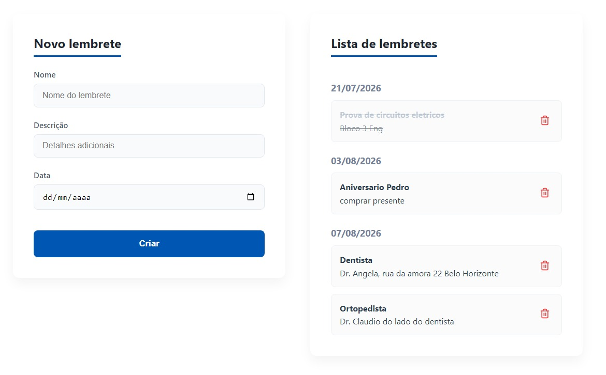
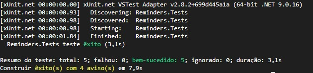

# 📅 Sistema de Lembretes - Teste Técnico dti digital

Este projeto foi desenvolvido como parte do processo seletivo da dti digital. Trata-se de uma aplicação web full-stack focada na criação, listagem e gerenciamento de lembretes diários.

## ✅ Atendimento aos Critérios de Avaliação

O projeto foi construído com foco rigoroso nos requisitos e bônus listados na especificação do teste:

*   **Qualidade do Código & Orientação a Objetos:** O backend em C# foi estruturado com separação de responsabilidades. O Controller não acessa o banco diretamente; as regras de negócio foram extraídas para uma camada de `Service` utilizando Injeção de Dependência, e a comunicação é feita de forma segura utilizando `DTOs`. Nomenclatura em inglês, clara e descritiva.
*   **Utilização de HTML Semântico:** O frontend utiliza tags HTML5 adequadas (`<main>`, `<section>`, `<form>`, `<label>`, `<ul>`, `<li>`) para garantir acessibilidade e estrutura correta, evitando o uso excessivo de `<div>` genéricas.
*   **[Bônus] Criação de API RESTful:** A API segue estritamente os padrões REST. Utiliza a rota limpa `/api/reminders` e aplica corretamente os verbos e status HTTP adequados para cada operação (`200 OK` para leitura, `201 Created` para criação com sucesso, `204 No Content` para exclusões e `400 Bad Request` para erros de validação).
*   **[Bônus] Pré/pós processadores de CSS:** A estilização foi construída utilizando **SASS (SCSS)** em conjunto com *CSS Modules*.

## ✨ Diferenciais e Decisões de Projeto

*   **Zero Bibliotecas de Componentes:** O layout responsivo em formato de "Cards" (dividindo a tela em Grid/Flexbox) e todos os botões e inputs foram estilizados puramente via código SASS.
*   **Validação Dupla de Datas:** Lembretes não podem ser criados no passado. Essa validação ocorre tanto visualmente no calendário do frontend quanto através de uma trava rígida na API (retornando `BadRequest`).
*   **UX (Experiência do Usuário):** Lembretes cuja data já tenha passado no momento da listagem recebem automaticamente um estilo de texto riscado (*strikethrough*) e opacidade reduzida para facilitar a visualização cronológica do usuário. Foi adicionado o campo de "descrição" para informações complementares do lembrete(opcional)
*   **Testes Unitários:** Implementação de uma camada de testes utilizando **xUnit** e **Moq** para garantir a resiliência do Controller e validar as respostas HTTP da API contra dados inválidos.

## 🛠️ Tecnologias Utilizadas

**Frontend:**
*   React + Vite
*   SASS (SCSS) + CSS Modules
*   JavaScript (ES6+)

**Backend:**
*   C# e ASP.NET Core | 8.0
*   Entity Framework Core | 8.0
*   Microsoft.EntityFrameworkCore.Sqlite | 8.0
*   Microsoft.EntityFrameworkCore.Tools | 8.0
*   SQLite (Banco de dados leve para fácil execução local)
*   xUnit + Moq (Testes Unitários) | Latest

---

## 🚀 Instruções para Executar o Projeto

### 1. Rodando a API (Backend)
1. Abra um terminal e navegue até a pasta principal da API (onde está o arquivo `Program.cs`).
2. Restaure os pacotes e execute o projeto com o comando:
   ```bash
   dotnet run
   ```
   A API inicializará e o banco de dados SQLite (reminders.db) será criado/lido automaticamente.
### 2. Rodando a Interface (Frontend)
1.  Abra um novo terminal e navegue até a pasta frontend.
2.  Instale as dependências do Node:
   ```bash
   npm install
   ```
3. Inicie o servidor de desenvolvimento:
    ```bash
   npm run dev
   ```
4. Acesse o link gerado no terminal (geralmente http://localhost:5173) no seu navegador.

  <p align="center">
  
  </p>

### 3. Rodando os Testes Unitários
1.  Abra um terminal e navegue até a pasta do projeto de testes (Reminders.tests)
2.  Execute a suíte de testes com o comando:
  ```bash
   dotnet test
   ```
3. O console exibirá o resultado das validações das regras de negócio do Controller.
   
<p align="center">
  
  </p>
